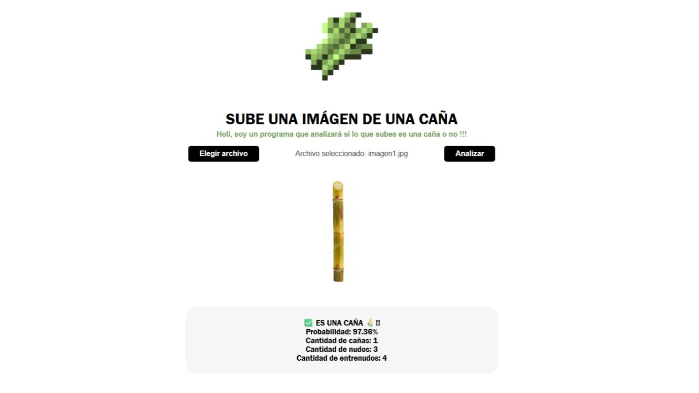
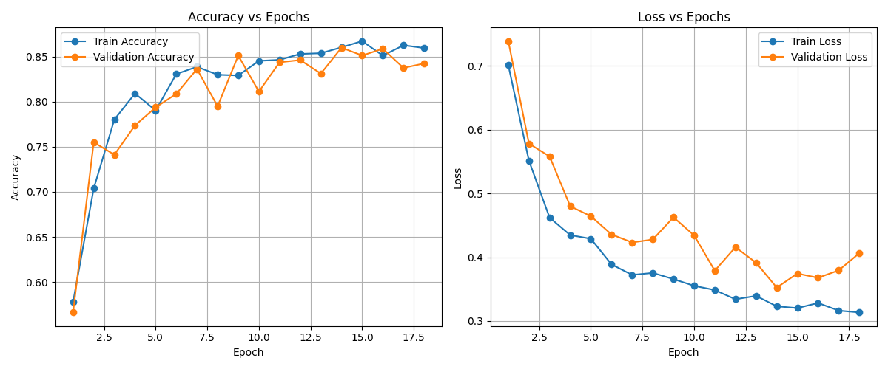
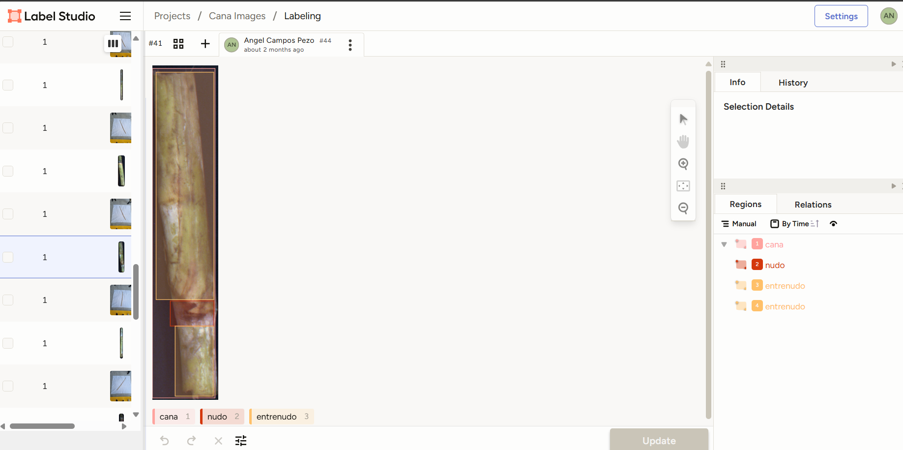

# Sugarcane Detection AI

---

## 🚨 SUPER IMPORTANT 🚨
All datasets and pre-trained models are available in this Google Drive folder:
[Download Datasets and Models (Google Drive)](https://drive.google.com/drive/folders/1wNsAS7rWQrlNNPh1YeuvZwvKAeNMqyL-?usp=sharing)

- There are **two datasets**: one for TensorFlow/Keras and one for YOLO.
- Pre-trained models (`best_model.keras` for Keras and `best.pt` for YOLO) are also available in the same folder.

---


*Web interface for uploading and analyzing sugarcane images.*


*Training and validation accuracy/loss curves using Keras (TensorFlow).* 


*Object detection and classification of sugarcane, nodes, and internodes using YOLO and Label Studio.*

## Project Overview
This project is an intelligent system for detecting sugarcane in images, as well as identifying and counting its nodes and internodes. It leverages state-of-the-art deep learning models:

- **TensorFlow/Keras**: For validating whether an image contains sugarcane, providing an extra layer of security and accuracy.
- **YOLOv8 (Ultralytics)**: For precise detection and counting of sugarcane, nodes, and internodes in images.
- **Flask**: To deploy a web API and a simple interface for uploading images and visualizing results.

## Key Features
- Python 3.10.11
- Binary classification (sugarcane or not) using a TensorFlow/Keras-trained model.
- Detection and counting of sugarcane, nodes, and internodes using YOLOv8.
- Intuitive web interface for image upload and result visualization.
- Visual results: cropped images of each detected object and probability metrics.

## Dataset Preparation & Annotation
### TensorFlow/Keras Dataset
- ~2,600 images were used, balanced between “cana” and “no_cana” classes for robust binary classification.
- Images were split for training and validation to ensure generalization.

### YOLOv8 Dataset
- 170 images were meticulously annotated using bounding boxes in Label Studio.
- Label conventions:
  - **cana**: 0
  - **entrenudo**: 1
  - **nudo**: 2
- Annotations were exported in YOLO format, with label mapping and dataset structure documented in [`dataset/notes.json`](dataset/notes.json).

## Model Training Details
### TensorFlow/Keras Training Highlights
- **Data Augmentation:** Random rotations, zoom, brightness adjustment, horizontal/vertical flips, width/height shifts, and shearing to increase dataset diversity and prevent overfitting.
- **Dropout Layer:** Dropout (0.5) to reduce overfitting.
- **EarlyStopping:** Stops training if validation loss does not improve for 4 epochs, restoring the best weights.
- **Model Architecture:** Multiple convolutional and pooling layers, followed by dense layers and sigmoid activation for binary classification.
- **Visualization:** Training and validation accuracy/loss curves are generated and saved for performance analysis.
- All these strategies are implemented in [`backend/training_test-keras_over.py`](backend/training_test-keras_over.py).

### YOLOv8 Training & Annotation Details
- The YOLOv8 model was trained using the script [`backend/training_test-yolo_over.py`](backend/training_test-yolo_over.py), referencing the dataset YAML file and running for 50 epochs with an image size of 640x640.
- This process generates a `runs` directory containing the best trained model (`best.pt`).
- This careful annotation and training strategy significantly improved the model's ability to accurately detect and distinguish between sugarcane, nodes, and internodes in real-world images.

## Workflow: How to Use This Project
1. **Download the datasets and models**
   - Go to the [Google Drive link](https://drive.google.com/drive/folders/1wNsAS7rWQrlNNPh1YeuvZwvKAeNMqyL-?usp=sharing).
   - Download the TensorFlow/Keras dataset and the YOLO dataset.
   - (Optional) Download the pre-trained models if you do not want to train from scratch.

2. **Train the models (if you want to train your own)**
   - For TensorFlow/Keras:
     - Use `training_test-keras_over.py` with the TensorFlow dataset.
     - This will generate a model file (e.g., `best_model.keras`) and a training graph.
   - For YOLO:
     - Use `training_test-yolo_over.py` with the YOLO dataset.
     - This will generate a `runs` folder containing the trained model (`best.pt`).

3. **Place the trained models in the correct location**
   - Put the Keras model (`best_model.keras`) inside `backend/models/`.
   - Put the YOLO model (`best.pt`) inside `backend/runs/cana_detect/weights/` (or as required by your code).

4. **Install dependencies**
   - Create a virtual environment and install requirements as described below.

5. **Run the application**
   - Navigate to the backend folder:
     ```bash
     cd backend
     python app.py
     ```
   - The app will be available at [http://127.0.0.1:5000](http://127.0.0.1:5000)

> **Note:** If you have any issues or want to skip training, you can use the pre-trained models from the Google Drive link above.

## Project Structure
- `backend/app.py`: Main API and logic (Flask).
- `backend/models/`: Trained models (`best_model.keras`, `best.pt`).
- `backend/static/`: Static files, prediction images, and styles.
- `backend/templates/index.html`: Web interface.
- `backend/training_test-keras_over.py`: Training script for the classification model.
- `backend/training_test-yolo_over.py`: Training script for YOLO.

## Requirements (requirements.txt)
Create a `requirements.txt` file with the following content:

```
flask
flask-cors
tensorflow
keras
ultralytics
pillow
numpy
```

> **Note:** If you use a GPU, install the appropriate TensorFlow version for your hardware.

## Professional Repository Name Suggestion
**sugarcane-detection-ai**

---

Ready! Now you can automatically detect sugarcane and analyze its features with deep learning.